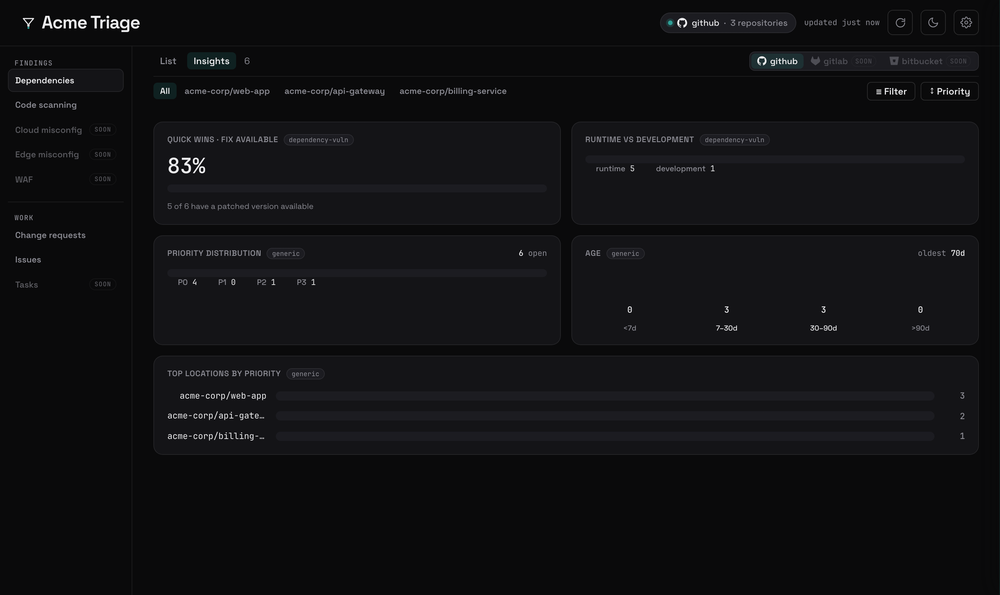

<p align="center">
  <picture>
    <source media="(prefers-color-scheme: dark)" srcset="assets/logo.svg" />
    
  </picture>
</p>

<p align="center"><em>Backend-free repo triage. One HTML file.</em></p>

<p align="center">
  <a href="https://www.npmjs.com/package/triagekit"></a>
  <a href="https://github.com/patrick204nqh/triagekit/actions/workflows/ci.yml"></a>
  <a href="LICENSE"></a>
  <a href="https://patrick204nqh.github.io/triagekit/"></a>
</p>

`triagekit` compiles into a single, self-contained HTML dashboard that runs entirely in
the browser — no backend, no build server, no third-party scripts, and no token baked in
(you paste your own at runtime). GitHub is the first provider: it groups what you triage
into **Findings** (Dependabot alerts, code scanning) and **Work** (pull requests, issues),
each scored, tiered, and sortable from a data-driven toolbar. PRs and issues open a review
panel with avatars and full-Markdown bodies; an optional **Insights** view swaps the table
for compositional charts.

<p align="center">
  <a href="https://patrick204nqh.github.io/triagekit/app/">
    
  </a>
  <br />
  <em><a href="https://patrick204nqh.github.io/triagekit/">Live demo →</a> · screenshots use fictional <code>acme-corp</code> data — the tool never ships or commits real repo names or tokens.</em>
</p>

## Quickstart

```bash
npx triagekit build --generic    # writes dist/triage.html
open dist/triage.html            # or double-click — it's just a file
```

In the page, open **Settings** (⚙) and connect a **fine-grained personal access token**
with read access to the resources you triage (Dependabot alerts, code scanning, pull
requests, issues), then use **"Find repositories I can access"** to pick your repos and
click **Load**. Your scope persists locally; the token stays in this tab only.

A prebuilt generic dashboard is also hosted at the [live demo](https://patrick204nqh.github.io/triagekit/) — connect a token and go, nothing to install.

## Build modes

| Mode | Command | Scope | Safe to share publicly? |
| --- | --- | --- | --- |
| **Generic** | `triagekit build --generic` | chosen at runtime in **Settings** | ✅ nothing source-specific is baked in |
| **Compiled** | `triagekit build` | a `scope` bag baked from `triage.config.yml` | ⚠ contains your repo names — team-internal only |

Generic mode is the general-purpose tool: build once, hand the HTML to anyone, and each
user connects a token and picks their repos. Compiled mode pre-bakes a specific scope for a
turnkey team dashboard. **Neither mode ever embeds a token** — each user always pastes
their own.

## Configuration (compiled mode)

```bash
cp triage.config.example.yml triage.config.yml   # the copy is gitignored
$EDITOR triage.config.yml                         # set your scope + branding
npx triagekit build                               # writes dist/triage.html
```

```yaml
source: github
# Compiled mode bakes a per-source scope bag (no token is ever embedded).
scope:
  repos:
    - acme-corp/web-app
    - acme-corp/api-gateway
    - acme-corp/billing-service
views:
  - code-security        # security findings: Dependabot + code scanning
  # - insights           # add to enable the Insights (charts) tab
branding:
  title: "Acme Triage"
# Optional: a JS/TS module exporting scoring overrides.
# logicHooks: ./triage.hooks.ts
```

## Security & token model

This repository is the **engine** — it contains **no** real org names, repo names,
hostnames, or tokens; everything that identifies *you* lives in gitignored inputs (see
[CONTRIBUTING.md](CONTRIBUTING.md#the-public--private-boundary)). The engine has **zero**
code path that reads or embeds a credential.

- **You paste your own token at runtime.** It is never read at build time or embedded in
  the HTML. Credentials are stored **per source** in `sessionStorage` — cleared when you
  close the tab, never persisted across sessions. Use a fine-grained PAT scoped to only the
  repos you triage. Never paste a token into a tracked file, screenshot, or commit.
- **Single file, no external scripts.** The build inlines everything (scripts, fonts) — no
  CDN. CI fails if any `src="http…"` reference appears in the output.
- **Strict, hash-based CSP** is computed at build time: `default-src 'none'`, a `script-src`
  allowing only the inlined script by its `sha256` hash (no `unsafe-inline`), and a
  `connect-src` limited to the configured provider's API origin.

## Settings

All configuration lives in the **Settings** slide-over (⚙). The command bar carries a
scope/health chip, a manual refresh, and a theme toggle; everything else lives in four tabs:

- **Connections** — add one **session-only** credential per source. Scope is schema-driven:
  discoverable sources (e.g. GitHub repos) offer **"Find … I can access"** (cached per
  credential). Scope is non-secret, so it persists in `localStorage` per source.
- **Scoring & priority** — tier cutoffs (P0 / P1 / P2; P3 is the implicit floor) and a
  per-kind score model — **Simple** weights or an **Advanced** formula over the kind's signals.
- **Filters** — a bot-account allowlist, so automation noise can be muted on the Work surfaces.
- **General** — **Appearance** (`Auto` / `Light` / `Dark`), **Auto-refresh** (optional 5- or
  10-minute snapshot re-fetch with an "updated *N*m ago" stamp), and **Data** (clear
  credentials or saved scope).

Compiled builds seed their baked `scope` automatically, so a turnkey dashboard only needs a token.

## Insights

The optional **Insights** view (add `insights` to `views`) renders a grid of charts for the
loaded items — a separate surface so the table stays a clean cockpit.

<p align="center"></p>

- **Snapshot-only.** Every chart is compositional (distribution / ranking / ratio), never a
  time-series — a backend-free fetch has no history to trend.
- **Contributed per kind.** Generic charts (priority distribution, age buckets, top
  locations) apply to everything; `dependency-vuln` adds a fix-available "quick wins" ratio
  and a runtime-vs-development split; `code-scanning` adds open-by-severity and by-tool
  breakdowns. New sources light up their own charts automatically.

## Customizing the scoring

Each kind ships a transparent built-in scorer (built on the shared `makeSeverityScorer`
factory). To override scoring without forking the engine, point `logicHooks` at a module
exporting a `score` function matching the `Scorer` type — it's bundled into the HTML at build time:

```ts
// triage.hooks.ts  (gitignored)
import type { Scorer } from "./src/runtime/scoring/registry";
import type { DependencyVulnDetails } from "./src/runtime/dataset/kinds/dependency-vuln";

export const score: Scorer = (item) => {
  const d = item.details as DependencyVulnDetails;
  return d.severity === "critical" ? 1000 : item.signal;
};
```

## Design

The visual language — a dark-first operations cockpit (Void Zinc canvas, a single Kelp Teal
accent, a semantic P0–P3 ramp, monospace numerals) — is documented in
[DESIGN.md](DESIGN.md). **Space Grotesk** and **JetBrains Mono** are self-hosted and inlined
(no CDN); the strict CSP allows fonts only via `font-src 'self' data:`.

## Contributing & license

Setup, the test/lint discipline, and the public/private boundary live in
[CONTRIBUTING.md](CONTRIBUTING.md). Released under the [MIT](LICENSE) license.
