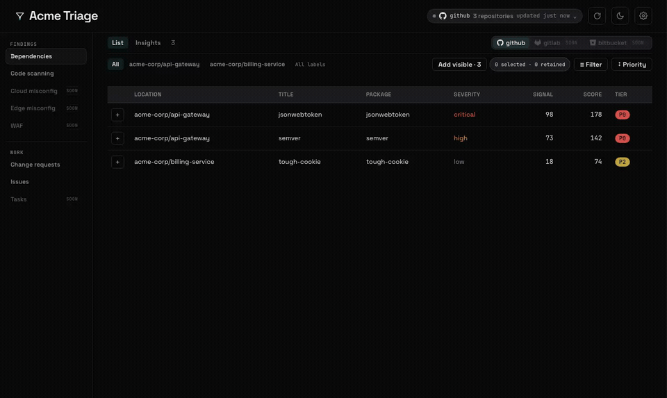
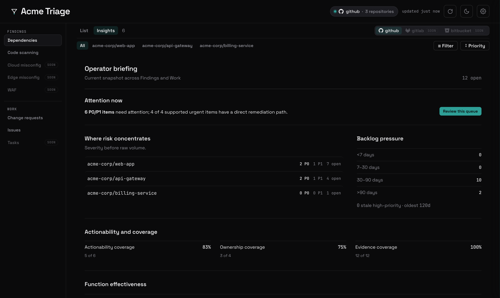

<!--
README MAINTENANCE CONVENTION

Audience: GitHub operators evaluating or using triagekit. Keep this page concise,
product-led, and usable as a 30-second path from evaluation to first triage.

Preserve this order:
1. Product promise and visual walkthrough
2. Current quick-start flow
3. Three-step operating model
4. Operator feature snapshot
5. Build and sharing modes
6. Security model
7. Links to authoritative project documentation

Keep UI instructions synchronized with the product. Prefer observable security
facts over trust claims. Link to PRODUCT.md, DESIGN.md, and CONTRIBUTING.md for
details instead of duplicating maintainer documentation here. Preserve the logo,
badges, screenshots, live-demo links, and fictional-data disclosure.
-->

<p align="center">
  <picture>
    <source media="(prefers-color-scheme: dark)" srcset="assets/logo.svg" />
    
  </picture>
</p>

<p align="center"><em>Backend-free repo triage. One HTML file.</em></p>

<p align="center">
  <a href="https://www.npmjs.com/package/triagekit"></a>
  <a href="https://github.com/patrick204nqh/triagekit/actions/workflows/ci.yml"></a>
  <a href="LICENSE"></a>
  <a href="https://patrick204nqh.github.io/triagekit/"></a>
</p>

`triagekit` turns GitHub pull requests, issues, Dependabot alerts, and code-scanning
alerts into one focused triage dashboard. It runs locally as a self-contained HTML file:
no application backend, no hosted account, and no credential embedded in the build.

Choose and prioritize repositories, work through explainable P0–P3 queues, and check
dataset freshness from the command bar. **Insights** adds an honest cross-dashboard
briefing for the data available now.

<p align="center">
  <a href="https://patrick204nqh.github.io/triagekit/app/">
    
  </a>
  <br />
  <em><a href="https://patrick204nqh.github.io/triagekit/">Live demo →</a> · screenshots use fictional <code>acme-corp</code> data — the tool never ships or commits real repo names or tokens.</em>
</p>

## Quick start

```bash
npx triagekit build --generic
open dist/triage.html
```

1. Open **Settings → Connections**, paste a fine-grained GitHub personal access token
   with read access to the resources you triage, and save.
2. Open **Repositories**, discover repositories, add the scope you need, arrange
   repository priority, and save.
3. Return to the dashboard and triage **Findings**, **Work**, and **Insights**.

The connection-status control in the command bar shows the active scope, dataset
freshness, and refresh cadence, with shortcuts back to Connections and Repositories.

A prebuilt generic dashboard is available in the
[live demo](https://patrick204nqh.github.io/triagekit/) — connect a token and start
triaging without installing anything.

## How it works

1. **Connect GitHub.** Credentials are session-only and managed separately from
   repository scope.
2. **Choose the queue.** Select and order repositories so the most important sources
   win priority ties.
3. **Triage with context.** Use Findings and Work for item-level decisions, then use
   Insights for a cross-dashboard briefing of the current snapshot.

Settings keeps each concern explicit: **Connections**, **Repositories**, **Scoring**,
**Exclusions**, and **General**.

## What operators get

- Dependabot and code-scanning findings in focused security queues.
- Pull requests and issues with review panels and rendered Markdown.
- Explainable P0–P3 scoring with sortable and filterable lists.
- Cross-repository Insights that distinguish current, stale, partial, and unsupported
  data instead of presenting missing coverage as zero.
- Locally saved non-secret scope and repository priority.
- Manual refresh, optional scheduled refresh, and visible dataset freshness.
- Light, dark, and system appearance modes.

<p align="center"></p>

## Build and share

| Mode | Command | Scope | Distribution |
| --- | --- | --- | --- |
| **Generic** | `triagekit build --generic` | chosen at runtime | safe to share publicly |
| **Compiled** | `triagekit build` | baked from `triage.config.yml` | team-internal; contains repository names |

Generic mode lets each operator choose scope at runtime. Compiled mode packages a shared
repository scope for a team. Neither mode embeds a credential.

```bash
cp triage.config.example.yml triage.config.yml
$EDITOR triage.config.yml
npx triagekit build
```

## Security model

- Credentials are entered at runtime, stored per provider in `sessionStorage`, and
  cleared when the tab closes.
- Repository scope and preferences are non-secret and may persist locally.
- The artifact has no external runtime script or stylesheet dependency.
- The build applies a hash-based Content Security Policy and limits network access to
  the configured provider API.

Keep private configuration out of the engine repository. The boundary is documented in
[Contributing](CONTRIBUTING.md#the-public--private-boundary).

## Learn more

- [Product principles](PRODUCT.md)
- [Visual and interaction design](DESIGN.md)
- [Example compiled configuration](triage.config.example.yml)
- [Contributing](CONTRIBUTING.md)
- [MIT license](LICENSE)
